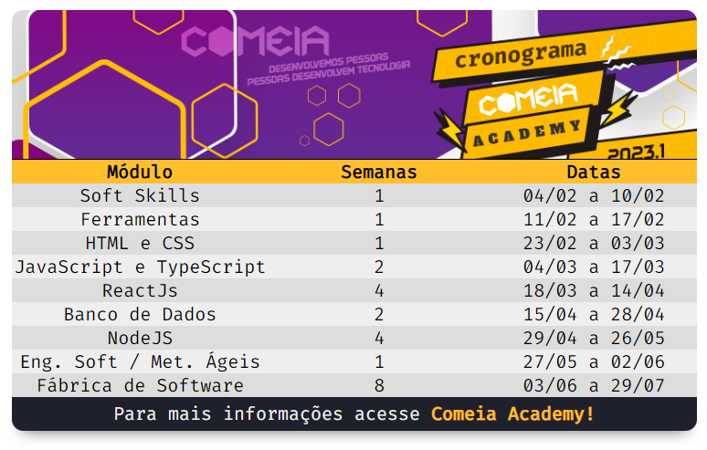

<h1 align="center"> Atividade 02 - Comeia Academy </h1>

Apenas uma demonstração de como criar um html. 

 

  <a href="https://comeia-academy.netlify.app" target="_blank"><strong>Link da Preview</strong></a>

  

## 🚀 Tecnologias

Esse projeto foi feito com as seguintes tecnologias:

- ✔️ HTML e CSS
